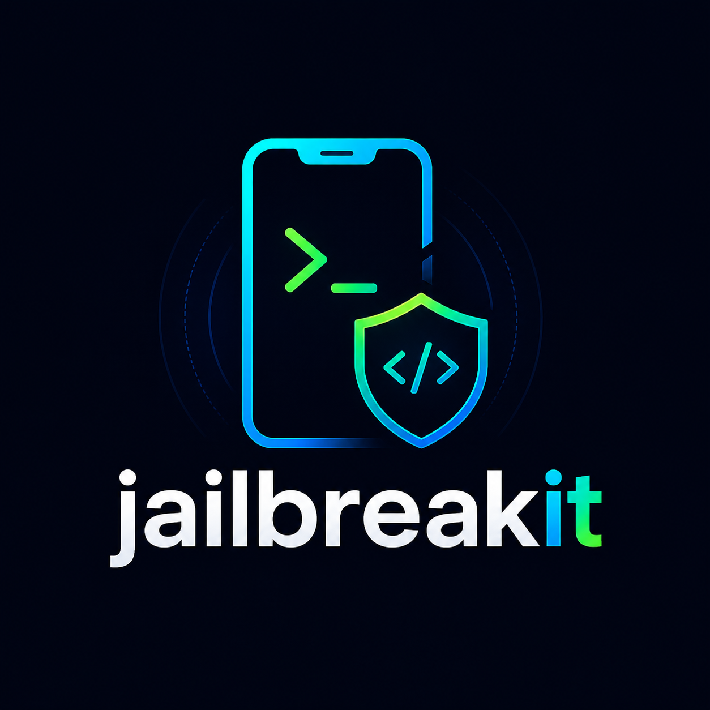

# jailbreakit

[](https://github.com/Waariss/jailbreakit/actions/workflows/ci.yml)
[](https://github.com/Waariss/jailbreakit/actions/workflows/release.yml)
[](https://github.com/Waariss/jailbreakit/releases)

<div align="center">
  
</div>

`jailbreakit` is an iOS Pentest Lab Setup Helper for authorized iOS security testing and research only.

It detects a connected iPhone, checks jailbreak compatibility, recommends a route, validates host/device readiness for dynamic analysis, and helps install local IPA files in an authorized lab. The goal is not to create or distribute a new jailbreak. The goal is to make repetitive iOS pentest lab setup easier for testers working on devices and applications they are allowed to assess.

Project documents:

- [Security policy](SECURITY.md)
- [MASTG-style positioning](docs/MASTG-POSITIONING.md)
- [v1.4.2 release notes](docs/RELEASE-v1.4.2.md)
- [Example outputs](examples/)
- [OWASP MASTG issue draft](docs/OWASP-MASTG-ISSUE-DRAFT.md)

## Why

iOS pentest lab setup is repetitive and easy to get wrong:

- identify the device model, chip, and iOS version
- check which jailbreak supports that version
- choose between `palera1n` and Dopamine
- run the correct first-time/rootful/rootless commands
- download the matching Dopamine IPA instead of the wrong latest release
- install a CLI signer and handle Apple ID login/2FA
- remember the iPhone trust-profile step after sideloading
- install local `.ipa` files directly onto an already-jailbroken iPhone over USB/SSH
- verify host dependencies for iOS dynamic analysis
- check Frida / Objection readiness without downloading device-side binaries
- generate lab readiness evidence for working notes

`jailbreakit` turns that into one guided flow:

```sh
jailbreakit
```

## Platform Support

Current target platforms:

- macOS
- Linux

Windows is not supported yet. The project is currently iPhone-first; iPad, iPod, Apple TV, and T2 metadata exist as initial compatibility data, but the main tested workflow is iPhone pentest lab setup for authorized security testing.

## Install

### Homebrew (Recommended for macOS)

The `Waariss/homebrew-tap` repository is published and the Formula is available:

```sh
brew install waariss/tap/jailbreakit
```

### Install with Go

Install the latest version from the public Go module:

```sh
go install github.com/Waariss/jailbreakit/cmd/jailbreakit@latest
```

Install a pinned version:

```sh
go install github.com/Waariss/jailbreakit/cmd/jailbreakit@v1.4.2
```

Make sure your Go binary directory, commonly `$(go env GOPATH)/bin`, is in `PATH`.

### Installer script

Install the latest GitHub Release binary:

```sh
curl -fsSL https://raw.githubusercontent.com/Waariss/jailbreakit/main/install.sh | sh
```

Install a pinned release:

```sh
curl -fsSL https://raw.githubusercontent.com/Waariss/jailbreakit/main/install.sh | JAILBREAKIT_VERSION=v1.4.2 sh
```

Use a custom install directory:

```sh
curl -fsSL https://raw.githubusercontent.com/Waariss/jailbreakit/main/install.sh | INSTALL_DIR="$HOME/.local/bin" sh
```

### GitHub Release binary

Release assets include macOS and Linux binaries for amd64 and arm64 plus `SHA256SUMS`. Download the matching binary from the [Releases page](https://github.com/Waariss/jailbreakit/releases), then verify it:

```sh
sha256sum -c SHA256SUMS --ignore-missing
```

On macOS, use `shasum -a 256 -c SHA256SUMS` if `sha256sum` is unavailable. Release binaries are not notarized yet; see the macOS note below.

### Build from source

```sh
git clone https://github.com/Waariss/jailbreakit.git
cd jailbreakit
go build -o jailbreakit ./cmd/jailbreakit
```

Run it:

```sh
./jailbreakit
```

### macOS Release Binary

Release binaries are not notarized yet. If macOS Gatekeeper blocks a downloaded binary with a message like "Apple could not verify ... is free of malware", remove the quarantine attribute and make it executable:

```sh
chmod +x jailbreakit-darwin-arm64
xattr -d com.apple.quarantine jailbreakit-darwin-arm64
./jailbreakit-darwin-arm64
```

For Intel Macs, replace `jailbreakit-darwin-arm64` with `jailbreakit-darwin-amd64`.

Signed and notarized macOS releases are not currently supported.

## Requirements

Core tools:

- Go 1.24+ to build from source
- `palera1n` for checkm8/palera1n flows
- `libimobiledevice` for `ideviceinfo` device detection
- `iproxy`, `ssh`, and `scp` for jailbroken-device IPA installs
- `ideviceinstaller` for host-side IPA install fallback
- `ideviceprofile`, `pymobiledevice3`, or macOS `cfgutil` for Burp CA profile installation
- `frida-tools` and `objection` for runtime testing readiness checks
- `curl` or network access for downloads

macOS:

```sh
brew install libimobiledevice libusbmuxd ideviceinstaller curl
```

Linux package names vary by distribution. Debian/Ubuntu-style systems usually need:

```sh
sudo apt install -y libimobiledevice-utils libusbmuxd-tools openssh-client ideviceinstaller curl
```

Check your machine:

```sh
./jailbreakit doctor
```

Install package-manager dependencies where supported:

```sh
./jailbreakit doctor --install
```

`palera1n` should be installed from the official project instructions. `jailbreakit` does not guess unofficial package sources for it.

## Usage

The normal user flow is intentionally short:

```sh
./jailbreakit
```

Common utility commands:

```sh
./jailbreakit doctor
./jailbreakit detect
./jailbreakit recommend --ios 15.8.8 --product iPhone8,1
./jailbreakit lab-check
./jailbreakit lab-check --device
./jailbreakit frida-check
./jailbreakit frida-check --device
./jailbreakit evidence --format markdown
./jailbreakit burp-ca --cert cacert.der --install
./jailbreakit burp-ca verify --cert cacert.der --profile burp-ca.mobileconfig
./jailbreakit sideload ./App.ipa
./jailbreakit install ./App.ipa
./jailbreakit install ./App.ipa --inspect
./jailbreakit version
```

Advanced commands are hidden from the default help:

```sh
./jailbreakit help advanced
```

## Development

Run tests:

```sh
go test ./...
```

Check formatting:

```sh
gofmt -w cmd internal
```

GitHub Actions runs formatting, tests, vet, and installation smoke checks on pushes and pull requests. The tag-driven release workflow builds macOS and Linux binaries only when a maintainer pushes a `v*` tag. See [docs/DISTRIBUTION.md](docs/DISTRIBUTION.md), [docs/HOMEBREW.md](docs/HOMEBREW.md), and [docs/RELEASING.md](docs/RELEASING.md).

## MASTG-Style Use Cases

`jailbreakit` supports authorized iOS lab workflows aligned with mobile application security testing preparation:

- preparing an iOS device for dynamic analysis
- checking host dependencies for iOS testing
- validating SSH / iproxy / IPA install readiness
- preparing for Frida / Objection runtime testing
- installing a Burp CA profile while leaving full certificate trust as an explicit user action
- generating lab readiness evidence for pentest notes
- supporting jailbreak-detection validation workflows on authorized devices

`jailbreakit` does not create a new jailbreak, exploit third-party devices, bypass app DRM, provide decrypted IPAs, store Apple ID credentials, or fetch Frida server binaries automatically.

For a jailbroken device, `frida-check --device` runs the read-only `frida-ps -U` check with a short timeout. It does not install `frida-server`. `burp-ca verify` validates a local certificate and mobileconfig profile; it cannot prove that iOS installed the profile or enabled Full Trust. `install --inspect` reads IPA metadata and exits without modifying or installing the archive.

## Lab Readiness

Run a practical readiness check for an authorized iOS dynamic analysis lab:

```sh
./jailbreakit lab-check
```

If you already started an SSH tunnel, optionally verify SSH with a harmless command:

```sh
iproxy 2222 22
./jailbreakit lab-check --ssh-host 127.0.0.1 --ssh-port 2222 --ssh-user root
```

For password-based SSH, add `--ssh-interactive`. The prompt belongs to `ssh`; `jailbreakit` does not read or store credentials:

```sh
./jailbreakit lab-check --ssh-host 127.0.0.1 --ssh-port 2222 --ssh-user root --ssh-interactive
```

Check host Frida / Objection readiness:

```sh
./jailbreakit frida-check
```

Generate evidence for working notes:

```sh
./jailbreakit evidence --format markdown
./jailbreakit evidence --format json --out lab-evidence.json
```

The evidence report includes host OS/architecture, available host dependencies, connected device information when available, recommended testing route when device data is available, IPA install readiness, Frida / Objection readiness, and the safety note:

```text
Generated for authorized iOS security testing only.
```

## Burp CA Profile

`jailbreakit` can generate a configuration profile from a local Burp CA certificate and optionally install that profile with `ideviceprofile`, `pymobiledevice3`, or macOS `cfgutil`:

```sh
./jailbreakit burp-ca --cert cacert.der --out burp-ca.mobileconfig
./jailbreakit burp-ca --cert cacert.der --install
```

This does not bypass iOS certificate trust. After installing the profile, make sure full trust is enabled on the iPhone:

```text
Did you enable full trust for the certificate?
Go to: Settings > General > About > Certificate Trust Settings
Then enable the toggle for: Burp Suite CA
```

Download or export the Burp CA certificate from your own Burp instance, for example through Burp's browser certificate export flow. `jailbreakit` does not fetch certificates from the network automatically.

If `--install` reports that no supported profile installer is available, install one of these host tools and retry:

```sh
python3 -m pip install pymobiledevice3
```

On macOS, Apple Configurator also provides `cfgutil`. Some Linux distributions may package `ideviceprofile`, but availability varies.

## What It Does

Guided mode:

1. Detects the connected device.
2. Maps `ProductType` to model and chip.
3. Checks the iOS jailbreak matrix from The Apple Wiki, with versioned embedded fallback data when the site is unavailable.
4. Shows compatible jailbreak routes.
5. Runs `palera1n`, or downloads and sideloads the matching Dopamine IPA.
6. Prints the next iPhone-side steps, including developer-profile trust instructions.

Example recommendation:

```text
ProductType:  iPhone8,1
Model:        iPhone 6s
Chip:         A9
iOS:          15.8.8

Options:
[1] palera1n 2.2.1 - rootless or rootful fakefs, semi-tethered
[2] Dopamine 2.5 Beta 3 - rootless, semi-untethered
```

For Dopamine `2.5 Beta 3`, `jailbreakit` resolves the release tag to `2.5b3` and downloads:

```text
https://github.com/opa334/Dopamine/releases/download/2.5b3/Dopamine.ipa
```

Routes outside the currently automated runners are still shown as recommendations when compatibility data is available. For example, iOS 12/13/14 may show tools such as Chimera, unc0ver, checkra1n, Odyssey, or Taurine as `recommend-only`. Those routes require the upstream tool or guide until runner automation is implemented.

## Dopamine Sideloading

`jailbreakit` is CLI-first. If no signer is available, guided mode can download the `plumesign` CLI, mark it executable, and continue.

Manual signer install:

```sh
./jailbreakit signer install --platform macos
./jailbreakit signer install --platform linux-aarch64
./jailbreakit signer install --platform linux-x86_64
```

Sideload an authorized local IPA through the detected external signer:

```sh
./jailbreakit sideload ./App.ipa
./jailbreakit sideload ./App.ipa --login --apple-id tester@example.com
```

Use another local signer by providing a command template. The `{ipa}` placeholder is shell-quoted before execution:

```sh
./jailbreakit sideload ./App.ipa \
  --command "plumesign sign --package {ipa} --apple-id --register-and-install"
```

Preview the resolved command without signing or installing:

```sh
./jailbreakit sideload ./App.ipa --dry-run
```

The signer is saved to:

```text
./bin/plumesign
```

Apple ID handling:

- `jailbreakit` does not store Apple ID credentials.
- Signing and authentication are delegated to the selected local signer.
- If credentials are required, the local signer handles password and 2FA prompts interactively.
- The selected signer may maintain its own local authentication or session state.
- Users are encouraged to use an app-specific password or a dedicated lab Apple ID.
- SideStore does not currently expose a direct integration in `jailbreakit`; use a supported external signer command where appropriate.
- Sideloading does not guarantee that private entitlements required by specialized jailbreak applications will remain usable. Follow the application's upstream installation guide.

After Dopamine is installed, trust the developer profile on the iPhone:

```text
Settings > General > VPN & Device Management
```

Then open Dopamine and tap Jailbreak.

## Install IPA on a Jailbroken iPhone

For an already-jailbroken iPhone, `jailbreakit` can copy and install a local `.ipa` without Apple ID signing. The default path uses USB via `iproxy`, then `scp` and `ssh` into the device:

```sh
./jailbreakit install ./App.ipa
```

Default connection details:

- host: USB tunnel to `127.0.0.1`
- local SSH port: `2222`
- device SSH port: `22`
- SSH user: `root`
- remote temp directory: `/tmp`
- installer mode: auto-detects `appinst`, then `ipainstaller`, then falls back to host-side `ideviceinstaller`

The iPhone must already be jailbroken and SSH must be running for the device-side install path. If neither `appinst` nor `ipainstaller` exists on the iPhone, `jailbreakit` falls back to `ideviceinstaller install <ipa>` on the host when available.

Host installation requires a code signature accepted by iOS. If iOS reports `ApplicationVerificationFailed`, use the explicit sideload flow for a normal test IPA:

```sh
./jailbreakit sideload ./App.ipa
```

Alternatively, use `appinst` or `ipainstaller` with AppSync on an authorized jailbroken device. Specialized packages such as TrollStore `.tipa` files must use their upstream-supported installation route.

To force host-side installation:

```sh
./jailbreakit install ./App.ipa --installer host
```

If your jailbreak uses a specific device-side installer command, override it:

```sh
./jailbreakit install ./App.ipa --installer ipainstaller
```

To install over Wi-Fi or another network route instead of USB:

```sh
./jailbreakit install ./App.ipa --host 192.168.1.23 --port 22
```

Useful flags:

```sh
./jailbreakit install ./App.ipa --user root --local-port 2223 --remote-dir /var/tmp
./jailbreakit install ./App.ipa --dry-run
```

Host requirements:

macOS:

```sh
brew install libusbmuxd libimobiledevice ideviceinstaller
```

Linux Debian/Ubuntu:

```sh
sudo apt install -y openssh-client libusbmuxd-tools ideviceinstaller
```

## palera1n Notes

Rootless flow:

```sh
./jailbreakit run palera1n --rootless
```

Rootful first-time BindFS creation:

```sh
./jailbreakit run palera1n --rootful
```

After the device returns to recovery mode, boot the existing rootful BindFS:

```sh
./jailbreakit run palera1n --rootful-boot
```

Guided mode handles this flow and tells the user when the second step is needed.

## Privacy

`jailbreakit` is local-first.

- No telemetry
- No remote command execution
- No Apple ID credential storage
- No device identifiers are uploaded by default
- Downloads are performed only from configured upstream project URLs

## Security & Third-Party Notices

This repository does not bundle third-party jailbreak binaries by default. It only references upstream tools, local installations, and upstream release downloads.

Third-party projects referenced or orchestrated by this tool have their own licenses, terms, and safety guidance:

- `palera1n` — follow the official project documentation and license
- `Dopamine` — follow the upstream release notes, license, and distribution terms
- `plumesign` — follow the upstream project terms and license
- The Apple Wiki — follow the site’s terms and attribution guidance

When available, verify downloaded artifacts against upstream checksums or signatures before use.

## Data

Compatibility and device metadata are versioned with the binary:

- `internal/matrix/compatibility.json` contains embedded fallback jailbreak data.
- `internal/device/product-map.json` contains embedded product metadata for iPhone-first detection, with initial iPad, iPod, Apple TV, and T2 coverage.

The Apple Wiki remains the preferred live source when reachable.

## Disclaimer

`jailbreakit` is intended strictly for authorized assessments, iOS pentesting, and responsible security research. Use it only on devices and environments where you have explicit permission.

Do not use this tool on devices you do not own or do not have explicit written permission to assess.

This project is a helper/orchestrator. It is not sponsored, endorsed by, or affiliated with Apple, `palera1n`, Dopamine, Impactor, or The Apple Wiki.

Jailbreaking can cause data loss, boot issues, restore requirements, or device instability. We are not responsible for any data loss, device damage, bricked devices, account issues, failed jailbreak attempts, or any other outcome caused by using this tool or the underlying third-party tools. When using `palera1n`, Dopamine, `plumesign`, or any related tooling, the user accepts full responsibility for anything that happens to their device during the process.

This tool does not bypass, and must not be used to attempt to bypass, iCloud, Activation Lock, MDM, passcodes, DRM/FairPlay, or device ownership protections.

Safety boundaries:

- `jailbreakit` does not create a new jailbreak.
- `jailbreakit` does not exploit third-party devices.
- `jailbreakit` does not bypass app DRM.
- `jailbreakit` does not provide decrypted IPAs.
- Users must only test devices and applications they are authorized to assess.

## Credits

This project orchestrates and references work from:

- [claration/Impactor](https://github.com/claration/Impactor)
- [opa334/Dopamine](https://github.com/opa334/Dopamine)
- [palera1n/palera1n](https://github.com/palera1n/palera1n)
- [The Apple Wiki](https://theapplewiki.com/wiki/Main_Page)

Respect the licenses, documentation, and safety guidance of the upstream projects.

## Status

Current public release for iOS pentest lab readiness. `jailbreakit` v1.4.2 adds an explicit local IPA sideload workflow while preserving authorized-testing boundaries and existing lab readiness features.

`jailbreakit` is an independent project and is not affiliated with, endorsed by, or officially maintained by OWASP.
